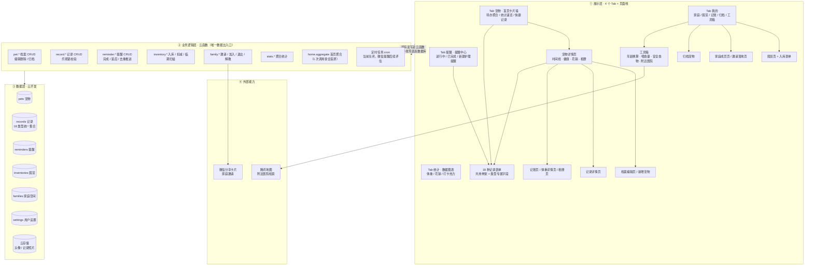
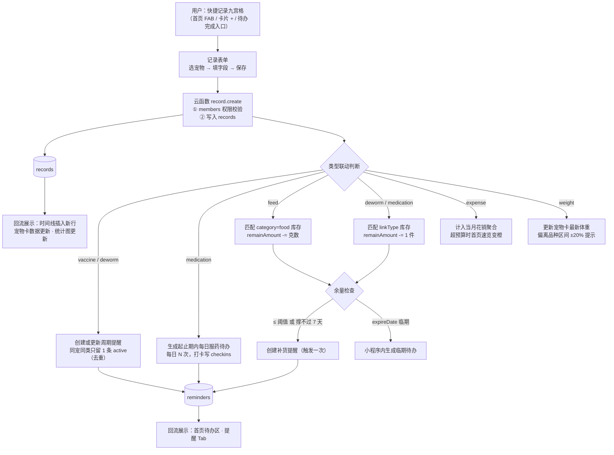
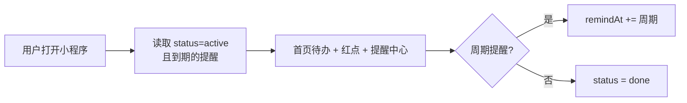
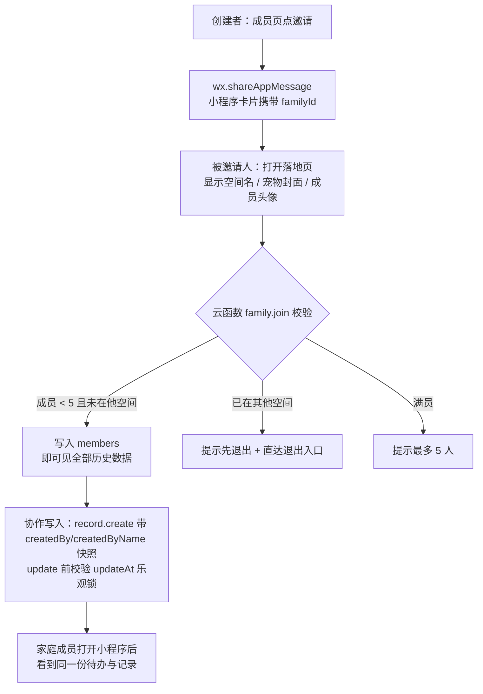
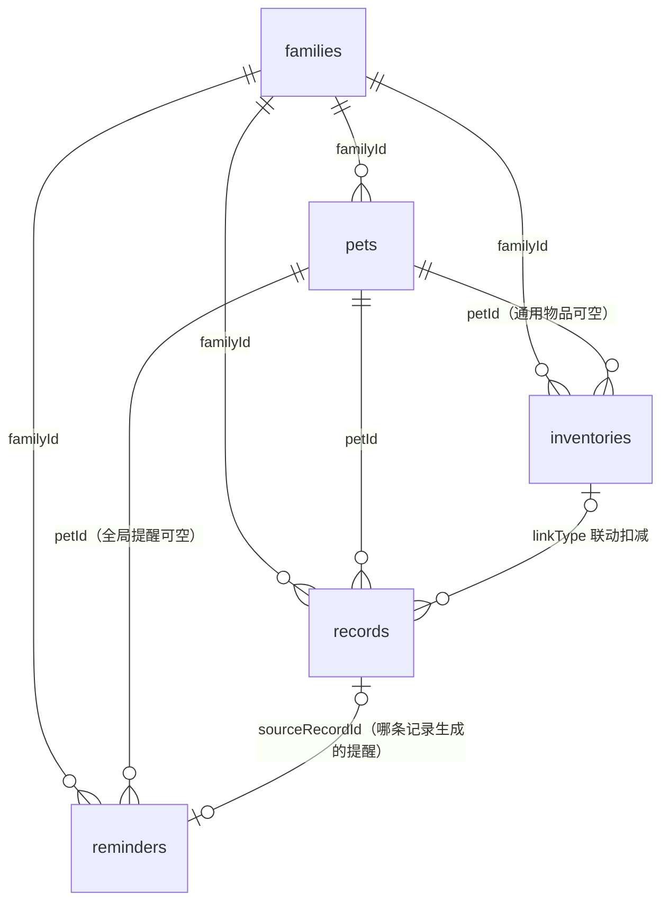

# 毛球档案袋 · 产品架构图与数据流图

| 项目 | 内容 |
|---|---|
| 对应文档 | PRD v1.1 / 设计语言 v2.2 / 页面审查与优化报告 v1 |
| 文档版本 | v1.0 |
| 文档日期 | 2026-08-14 |
| 用途 | 开发前的全局视图：模块怎么分层、数据怎么流动、联动在哪发生 |

> 本文所有图为 Mermaid，可直接在支持 Mermaid 的 Markdown 阅读器（VS Code 插件 / Typora / GitHub）中渲染。

---

## 1. 产品架构图（功能分层视图）

**分层要点：**

- 展示层任何页面**不直连数据库**，这是家庭共享权限模型（members 校验）的前提，也是 4.7 的硬约束。
- `home.aggregate` 一个云函数返回首屏全部数据（宠物卡 + 待办 + 统计速览 + 成员），保证冷启动 ≤2s。
- 工具箱是纯前端模块（年龄换算 / 喂食量 / 安全食物为本地计算 + 离线 JSON），只有附近医院调外部接口，**不依赖登录态，首次进入即可用**——它是新用户体验产品的零成本入口。

---

## 2. 核心数据流图

### 2.1 记一笔 → 全链路联动（产品最核心的一条流）

### 2.2 提醒展示流（仅小程序内）

### 2.3 家庭共享流

### 2.4 数据归属关系（一图看懂权限）

> 权限规则：云函数内校验「请求人 openid ∈ families.members」；`_openid` 仅用于审计和「我创建的」筛选，不再是隔离边界（v1.1 已修正 PRD 4.3/4.4 与 4.6 的矛盾）。

---

## 3. 云函数清单（开发接口边界）

| 云函数 | 职责 | 关键规则 |
|---|---|---|
| `home.aggregate` | 首屏聚合 | 1 次调用返回宠物卡 + 待办 + 统计速览 + 成员头像 |
| `pet.create / update / remove / archive` | 档案 | remove 级联删 records/reminders/inventories + 云存储图片；archive 同步停用其全部 active 提醒 |
| `record.create / update / remove` | 记录 | 写入后执行 §2.1 联动；update 乐观锁；remove 时若存在 sourceRecordId 派生提醒则提示「关联提醒将一并处理」 |
| `reminder.create / update / complete / postpone / disable` | 提醒 | complete 周期推进；同宠同 category 去重 |
| `inventory.inbound / consume / update` | 囤货 | consume 后做阈值与临期检查 |
| `family.invite / join / leave / removeMember / dissolve` | 家庭 | join 校验名额与唯一空间；dissolve = 创建者退出 |
| `stats.summary` | 统计聚合 | 按月/半年/年聚合，图表数据 |
| `cron.hourly` | 预留定时任务 | 当前关闭；微信提醒接入时再评估 |

---

*文档结束 · 产品架构图与数据流图 v1.0*
